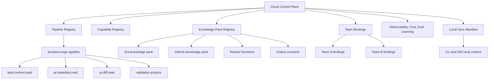

# Kodus Skills Architecture: Cloud, Local, Sync, and Learning

## Purpose

This document consolidates the target architecture for delivering Kodus skills and pipelines, starting with `business-logic` as the first governed product experience.

The goal is not to ship "isolated skills" as the main user-facing concept. The goal is to ship reliable, observable, governed development workflows that can run in Kodus cloud first and later sync to local runtimes.

## Executive Summary

The recommended model is:

- `pipeline` as the visible product
- `capabilities` as reusable execution blocks
- `knowledge packs` as structured, versioned guidance
- `team bindings` as the layer that connects skills to real MCPs, providers, and policies
- `cloud` as the control plane and source of truth
- `local` as an optional synchronized runtime

For the first phase, the product to deliver is:

- `business-logic`

Everything else should support that delivery.

## Product Model

### What users should see

Users should activate workflows such as:

- `business-logic`
- `pr-quality-check`
- `issue-to-pr-context`

Users should not need to compose raw skills or capabilities manually for normal use.

### What the platform should manage internally

Under the hood, each pipeline uses reusable capabilities such as:

- `task-context.read`
- `pr.metadata.read`
- `pr.diff.read`
- `validation.analyze`

This keeps the user experience simple while preserving reuse and composability inside the platform.

## Core Concepts

### Pipeline

A pipeline is the primary product experience.

Examples:

- `business-logic`
- future `release-readiness`
- future `spec-compliance`

A pipeline orchestrates multiple capabilities and knowledge packs to solve a concrete workflow end to end.

### Capability

A capability is a reusable execution primitive.

Examples in the current codebase:

- `task-context.read`
- `pr.metadata.read`
- `pr.diff.read`

Capabilities should be reusable across multiple pipelines.

### Knowledge Pack

A knowledge pack is structured, versioned domain guidance used by agents and pipelines.

Examples:

- Jira task-context heuristics
- GitHub review heuristics
- output formatting rules
- acceptance criteria classification rules

Knowledge packs should be progressive-disclosure friendly and cheap to load.

### Team Binding

A team binding defines how a given team uses a pipeline in practice.

It includes:

- enabled providers
- MCP connections
- allowed tools
- rollout version
- fallback policies
- cost limits
- quality thresholds

This is the layer that makes pipelines usable in real organizations.

## Recommended Architecture



## Cloud vs Local

### Cloud should be the source of truth

Cloud should own:

- pipeline versioning
- capability compatibility
- knowledge pack versions
- team bindings
- observability
- learning signals
- rollout policy
- governance
- cost tracking

### Local should be a synchronized runtime

Local should:

- download a manifest generated by cloud
- execute the same pipeline version
- use local or remote MCP bindings
- preserve the same contracts and policies where possible
- report telemetry back to cloud

Local should not become a separate, independent ecosystem.

## Why this model fits the problem

The target problem is not "let users install skills."

The target problem is:

- teams use Jira, GitHub, PR review, tests, and MCP-connected tools every day
- they need reliable workflows
- they need consistency across team members
- they need observability into what is working and what is not
- they need a way to improve quality and reduce token cost over time

This is a workflow and governance problem first, and a skill packaging problem second.

## First Product: Business Logic

### Why start here

`business-logic` is already a concrete, high-value workflow.

It already exercises the platform through:

- task context resolution
- PR metadata resolution
- PR diff resolution
- quality classification
- validation analysis
- fallback behavior

This makes it the correct first governed pipeline.

### Target shape for `business-logic`

Visible product:

- `business-logic`

Internal execution blocks:

- `task-context.read`
- `pr.metadata.read`
- `pr.diff.read`
- `validation.analyze`

Associated knowledge packs:

- Jira task context references
- GitHub PR review heuristics
- business rules output format
- task quality classification guidance

## What the current code already gives us

The current codebase already has strong starting points:

In `libs/agents/skills`:

- reusable capabilities
- runtime strategy concepts
- deterministic execution helpers
- capability traces
- provider-aware runtime behavior

In `libs/agents/infrastructure/services/kodus-flow/business-rules-validation`:

- a real pipeline with steps
- PR/task fetching flow
- gate-based progression
- LLM analysis stage
- business-facing output formatting

This means Kodus is already beyond proof of concept. The remaining work is architectural consolidation, not invention from scratch.

## What needs to be adjusted

### 1. Make pipeline vs capability boundaries explicit

Current direction is mostly correct, but the separation needs to be formalized:

- `business-rules-validation` should remain a pipeline
- reusable blocks should continue moving into `libs/agents/skills/capabilities`

Rule:

- if another workflow could use it, it belongs in a capability
- if it is specific to `business-logic`, it stays in the pipeline

### 2. Formalize knowledge packs

Not all reusable knowledge belongs in code.

Some guidance should live as structured versioned assets:

- provider-specific references
- acceptance criteria heuristics
- output contracts
- golden examples
- migration and troubleshooting guidance

This is especially important for local sync and consistent execution across environments.

### 3. Introduce team bindings as a first-class concept

Current runtime already resolves providers and tools, but the platform needs a more explicit configuration layer per team.

A team binding should define:

- active providers
- MCP endpoints or packages
- allowlisted tools
- preferred tools
- fallback policies
- agentic vs deterministic resolution behavior
- budget and latency limits

### 4. Strengthen observability and learning as platform features

The current execution traces are a good start, but they need to grow into a platform feedback loop.

## Observability Model

Every pipeline execution should record:

- pipeline name
- pipeline version
- capability versions when relevant
- organization and team
- provider bindings used
- MCP tools used
- chosen path:
  - deterministic only
  - deterministic then fallback
  - agent-first
- token usage
- latency per step
- fallback reasons
- output quality
- human feedback if available

This answers the practical questions teams care about:

- Did it work?
- What did it cost?
- Which tool path succeeded?
- Where did it fail?
- Is the result trustworthy?

## Learning Model

Learning should be governed.

It should not mean "let the model rewrite itself."

It should mean:

- learn which tools work best for a team
- learn which provider-specific examples improve output
- learn which fallback paths are too expensive
- learn which prompts or knowledge packs are low-value
- learn which outputs humans approve or reject

This learning should influence:

- preferred tool ordering
- cached tool strategy
- rollout of better defaults
- quality scoring
- cost optimization decisions

## Governance Model

Governance should include:

- pipeline versioning
- knowledge pack versioning
- team-specific rollout
- canary releases
- allowlist and denylist of tools
- write-action gates
- audit trail of execution path
- cost controls
- quality thresholds for auto-publish vs human review

The platform should make it easy to answer:

- Which version did this team run?
- Which MCPs and tools were involved?
- Why did the pipeline pick this path?
- Was this result approved by users?

## Cost and Token Strategy

The most practical token savings come from:

- deterministic capabilities before agentic fallback
- local or embedded knowledge packs before remote lookups
- preferred tool caching by team/provider
- smaller provider-specific guidance instead of giant general prompts
- reducing duplicate context loads across steps

Cloud should measure these savings and surface them at pipeline and team level.

## Guidance from reference systems

This architecture is reinforced by patterns seen in:

- `Mastra Skills`
  - skills as structured knowledge
  - embedded docs as first-class context source
  - remote docs as fallback
- `Repo Hub (rhm)`
  - pipeline + agents + MCPs + skills + config generation
  - strong local runtime story
- `Ring`
  - team/plugin packaging
  - policy and multi-role workflow organization
- `Superpowers`
  - strong process governance
  - testing and distribution discipline

The important conclusion is:

- no single reference is the answer
- Kodus should combine:
  - Mastra's knowledge packaging
  - Repo Hub's workflow model
  - Ring's team packaging
  - Superpowers' discipline and verification mindset

## Proposed target structure

Suggested medium-term structure:

```text
libs/agents/skills/
  capabilities/
  runtime/
  registry/
  manifests/
  knowledge-packs/
  learning/
  telemetry/

libs/agents/infrastructure/services/kodus-flow/
  business-rules-validation/
    pipeline/
    prompts/
    policies/
    contracts/
    formatters/
```

This does not need to be implemented all at once. It is a target direction.

## Delivery phases

### Phase 1: Deliver `business-logic`

Focus:

- stable pipeline in cloud
- clear capability boundaries
- reliable task context and PR resolution
- observability and cost visibility
- governed output

### Phase 2: Introduce manifests and team bindings

Focus:

- explicit pipeline manifests
- explicit team bindings
- provider and MCP configuration layer
- versioned rollout

### Phase 3: Local sync

Focus:

- export cloud-approved manifest
- run same pipeline locally
- use local or remote MCP config
- send telemetry back to cloud

### Phase 4: Governed learning

Focus:

- tool effectiveness learning
- team-specific tuning
- eval-based rollout
- quality-aware default evolution

## Concrete recommendations for current code

### Keep as pipeline

- `libs/agents/infrastructure/services/kodus-flow/business-rules-validation`

### Keep extracting as reusable capabilities

- `libs/agents/skills/capabilities/task-context-read.ts`
- `libs/agents/skills/capabilities/pr-metadata-read.ts`
- `libs/agents/skills/capabilities/pr-diff-read.ts`

### Add next

- a manifest concept for `business-logic`
- a team binding concept for providers and MCPs
- more explicit cost and quality telemetry fields
- knowledge pack organization for provider/domain guidance

## Final recommendation

Do not frame the effort as "building a skills platform."

Frame it as:

- delivering the first governed development pipeline
- proving the `cloud + local + sync + learning` model through `business-logic`
- using capabilities and knowledge packs internally to make future pipelines cheaper to build

If this is done well, `business-logic` becomes both:

- a useful product now
- and the reference implementation for the broader Kodus platform
