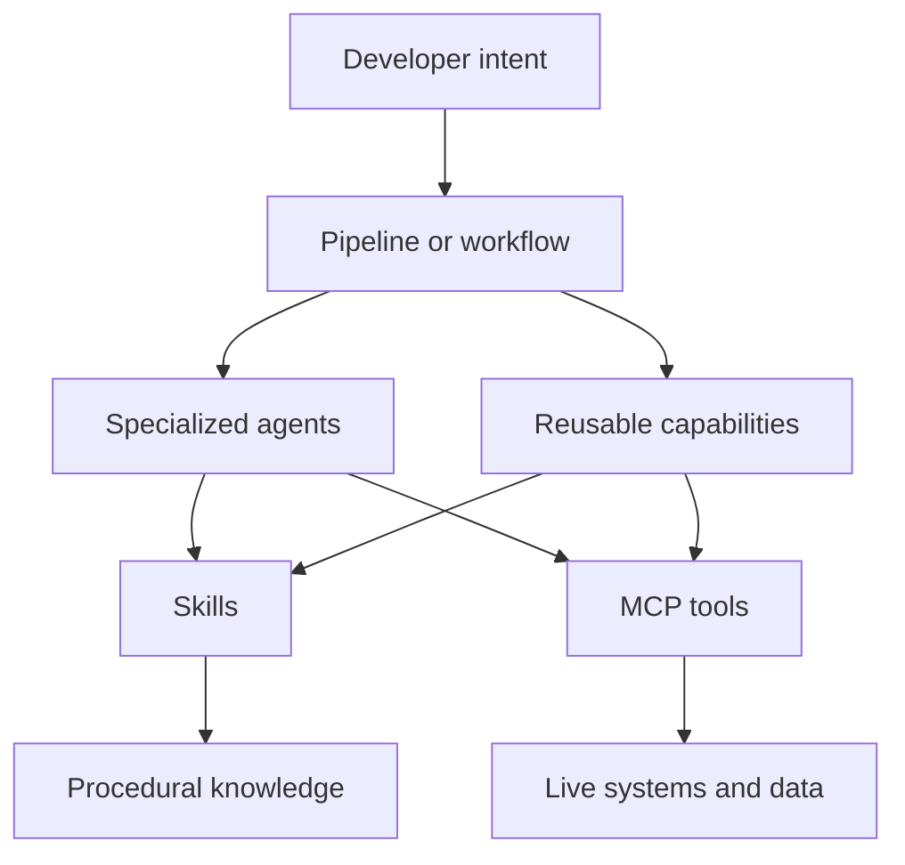
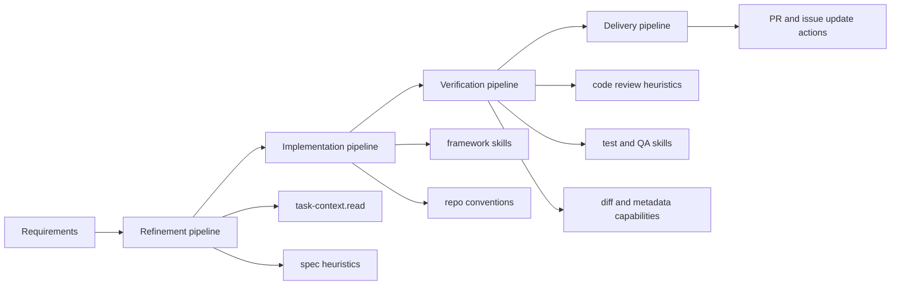
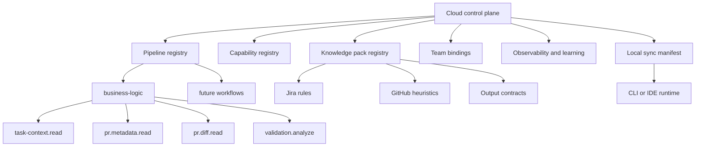

# Skills in the SDLC: Research Notes, Mental Maps, and Daily Use Cases

## Objective

This document captures research and synthesis to answer a practical question:

> Does the way Kodus is building skills and pipelines align with how software teams actually use agents and skills in day-to-day development?

The focus is not theoretical agent design. The focus is:

- what teams are trying to solve in practice
- which kinds of skills appear useful in real workflows
- where skills fit relative to MCPs, agents, commands, plugins, and pipelines
- whether the current Kodus direction makes sense

## Research inputs

Primary and product-adjacent references used in this synthesis:

- Anthropic:
  - `Skills overview`
  - `Agent Skills`
  - `Plugins overview`
  - `Plugins`
  - `Equipping agents for the real world with Agent Skills`
- OpenAI:
  - `Agent Builder`
  - `Agents`
  - `Trace grading`
  - `Agent evals`
  - `Docs MCP`
  - `Safety in building agents`
- Mastra:
  - `Announcing Mastra Skills`
  - `Build with AI / Skills`
  - `Announcing Mastra Workspaces`
- Repo references:
  - `Repo Hub (rhm)`
  - `Ring`
  - `Superpowers`
  - `pr-reviewer-skill`
  - `weaviate/agent-skills`

Links are listed at the end of this document.

## The main conclusion

Teams are not primarily adopting "skills" as a product category.

They are adopting:

- workflow automation
- specialized agent roles
- reusable knowledge packs
- tool access via MCP
- structured review and verification loops

In other words:

- users want a reliable outcome
- teams want a repeatable workflow
- platform engineers want modular reusable building blocks

This strongly suggests the following product model:

- `pipeline` is what the user experiences
- `skills` are structured knowledge and reusable procedures
- `MCPs` are tool and data access
- `agents` are role-specialized executors
- `cloud` is governance and observability
- `local` is execution convenience

## What teams seem to be using in practice

Across the references, the recurring day-to-day workflows are:

### 1. Planning and refinement

Examples:

- write or refine a feature spec
- break down a Jira/Linear issue
- analyze repository impact before implementation
- create task breakdown and delivery plan

### 2. Context retrieval

Examples:

- read Jira/Linear issues
- compare issue requirements against a PR
- fetch docs for a framework or library
- inspect logs, dashboards, or infrastructure state

### 3. Implementation

Examples:

- implement backend changes
- implement frontend changes
- apply project conventions
- follow framework-specific patterns

### 4. Verification

Examples:

- run tests
- create tests
- lint and build
- browser QA
- review code against requirements or heuristics

### 5. Delivery

Examples:

- open PR
- publish summary
- update issue state
- post to Slack/Chat

The practical insight:

teams are using agents in the SDLC where context switching and coordination cost are high, not where pure code generation alone is enough.

## Mental map: where skills fit

Interpretation:

- `skills` provide procedural knowledge and project or domain context
- `MCPs` provide live access to tools and systems
- the pipeline coordinates both

## What a skill appears to be in real systems

Based on Anthropic, Mastra, and the repos inspected, the most useful definition is:

> A skill is a structured, progressively-disclosed package of instructions, scripts, references, and examples that teaches an agent how to perform a narrow class of tasks well.

### What a skill is not

A skill is not:

- the entire product workflow
- the MCP itself
- the orchestration layer
- the agent runtime
- a generic "do anything" expert

### What a good skill usually contains

- a clear `SKILL.md`
- narrow scope
- optional references
- optional scripts
- examples or golden patterns
- activation clues

### What a bad skill usually looks like

- too broad
- too many unrelated responsibilities
- unclear activation
- hidden dependencies
- no scripts or references where determinism matters
- no test or validation guidance

## What seems to work well

### Pattern 1: Progressive disclosure

Observed in:

- Anthropic Skills docs
- Mastra Skills
- Agent Skills spec

Why it works:

- low token overhead at startup
- detailed context only when relevant
- easier packaging of bigger expertise sets

Implication for Kodus:

- provider and domain guidance should move into explicit knowledge packs
- not all context should live in code or giant prompts

### Pattern 2: Deterministic first, agentic second

Observed in:

- current Kodus direction
- Mastra's docs and skills split
- practical agent systems that keep tools narrow

Why it works:

- lower cost
- better debuggability
- smaller chance of hallucinated orchestration

Implication for Kodus:

- current direction with deterministic capabilities before fallback is correct

### Pattern 3: Team-pack or plugin packaging

Observed in:

- Ring
- Claude plugins
- Repo Hub generated outputs

Why it works:

- teams adopt workflows, not raw primitives
- best practices become shareable
- onboarding is much easier

Implication for Kodus:

- the long-term unit of delivery should likely be a governed team-facing package, not scattered skill files

### Pattern 4: Local artifacts and auditability

Observed in:

- pr-reviewer-skill
- Repo Hub task outputs
- software workflows that save review, QA, and requirement files

Why it works:

- easier debugging
- easier handoff between agents or humans
- easier compliance and review

Implication for Kodus:

- outputs like task context, review findings, and decision traces should be treated as first-class artifacts

### Pattern 5: Evaluation and trace visibility

Observed in:

- OpenAI trace grading and agent evals
- Anthropic emphasis on workflow discipline

Why it works:

- teams need to know what path the system took
- platform builders need reproducible quality feedback

Implication for Kodus:

- execution traces should evolve into product-level observability and learning signals

## The main pain points repeated across systems

### Pain 1: stale or missing context

Mastra explicitly called out the challenge of keeping agents up to date on the tools and frameworks being used.

Practical version:

- agent does not know the current project rules
- agent does not know framework-specific constraints
- agent does not know the linked issue

### Pain 2: too much context in prompts

Anthropic and Agent Skills docs point toward progressive disclosure because dumping everything into the prompt is not scalable.

Practical version:

- token waste
- reduced precision
- hidden prompt drift

### Pain 3: orchestration inconsistency

Systems like Ring and Repo Hub exist because ad hoc delegation is unreliable.

Practical version:

- steps get skipped
- review happens too late
- tests are forgotten
- humans need to repeatedly steer the same process

### Pain 4: poor tool boundaries

OpenAI safety guidance and Anthropic plugin models both reinforce structured control and approvals.

Practical version:

- too many tools exposed
- wrong tools called
- write access used too early
- prompt injection risk rises when arbitrary text drives tools

### Pain 5: weak visibility into quality and cost

OpenAI's evals and trace grading exist because trace-level understanding matters in production.

Practical version:

- teams do not know what is working
- platform owners do not know why costs are high
- no repeatable signal for rollout decisions

## Mental map: SDLC use cases for skills and pipelines

## Daily use cases that appear broadly useful

The following use cases seem likely to matter across many software teams:

### Use case 1: Issue to implementation context

Goal:

- take a Jira or Linear issue
- resolve requirements
- map impact
- prepare implementation context

Good fit for skills:

- task context resolution
- issue parsing heuristics
- repo exploration guidance

### Use case 2: PR business logic validation

Goal:

- compare task expectations with actual code changes
- identify missing requirements, incorrect behavior, or weak evidence

Good fit for skills:

- task-context.read
- pr.diff.read
- validation heuristics
- output contracts

This is the current Kodus `business-logic` pipeline.

### Use case 3: Framework-aware implementation

Goal:

- apply project conventions and framework patterns without restating them every time

Good fit for skills:

- NestJS patterns
- Next.js patterns
- testing conventions
- architecture rules

### Use case 4: Verification and review

Goal:

- automatically check code, tests, edge cases, and risk areas before merge

Good fit for skills:

- code review heuristics
- security review heuristics
- test review heuristics
- consequences or ripple-effect analysis

### Use case 5: Multi-repo change coordination

Goal:

- coordinate backend, frontend, infra, and issue state changes in one flow

Good fit for pipelines:

- orchestrator
- specialized agents
- MCP-backed actions
- local artifacts

This is closer to Repo Hub's model than to isolated skills.

## What seems broadly valid about the current Kodus direction

The current Kodus direction appears valid in several important ways:

### Valid point 1: `business-logic` as first product

This is the right first governed workflow because it combines:

- external task context
- PR context
- domain judgment
- review output

That makes it a strong first proving ground.

### Valid point 2: reusable capabilities

The existence of:

- `task-context.read`
- `pr.metadata.read`
- `pr.diff.read`

is the correct abstraction direction.

These are reusable and clearly broader than a single pipeline.

### Valid point 3: deterministic + fallback design

This is aligned with both cost and reliability concerns seen in real systems.

### Valid point 4: provider-aware behavior

This matters in practice because teams do not all use the same stack of issue trackers and code hosts.

## What still looks incomplete in Kodus

### Gap 1: weak explicit model of team packaging

Right now, capabilities and pipelines exist, but the team-level configuration and distribution model is not yet first-class.

This matters because real adoption happens through:

- team defaults
- shared conventions
- governed rollout

### Gap 2: knowledge packs are not formalized enough

Some knowledge still lives too much in code and prompt assembly rather than explicit versioned assets.

### Gap 3: observability is not yet a product capability

There are traces, but the platform-level questions still need clearer answers:

- what succeeded
- what cost too much
- which path is best for which team

### Gap 4: local sync story is not yet explicit

The local runtime vision exists conceptually, but not yet as a clear manifest and sync model.

## Mental map: what Kodus should become

## Recommended interpretation of cloud, local, and learning

### Cloud

Cloud should own:

- canonical versions
- team bindings
- evals
- rollout
- cost visibility
- learning summaries

### Local

Local should own:

- execution convenience
- access to local repos and local MCPs
- user workflow integration

But local should remain synchronized to cloud-approved manifests.

### Learning

Learning should mean:

- tool effectiveness by provider and team
- fallback effectiveness
- output quality feedback
- cost optimization opportunities

Learning should not mean:

- silent self-modifying behavior
- uncontrolled prompt drift

## Practical skill categories that seem most useful

Based on the research, the most useful categories appear to be:

### Process skills

Examples:

- planning
- TDD
- debugging
- review discipline

These improve how agents work.

### Framework or stack skills

Examples:

- NestJS
- Next.js
- database and infra patterns

These improve implementation quality.

### Workflow skills

Examples:

- PR review
- issue refinement
- QA planning

These improve repeatability.

### Domain knowledge skills

Examples:

- billing rules
- tenant isolation review
- regulatory templates

These improve business correctness.

For Kodus, `business-logic` sits closest to:

- workflow skill
- domain validation pipeline

## What does not seem to scale well

The following patterns look weak or risky:

- giant universal skills
- exposing broad MCP tool surfaces without policy
- relying entirely on generic prompts
- treating local and cloud as separate product lines
- no artifact trail between steps
- no eval loop

## Recommendation

The current Kodus direction makes sense, but it should be framed more precisely.

Kodus should aim to become:

> a cloud-governed pipeline and capability platform for software development workflows, with local execution support, team bindings, structured knowledge packs, and learning from trace-level feedback

The first workflow to prove this model should remain:

- `business-logic`

## Immediate implications for the roadmap

### Short term

- stabilize `business-logic`
- reinforce capability boundaries
- improve observability and trace usefulness
- formalize knowledge assets

### Medium term

- define team binding manifests
- define sync and version model
- define quality and cost dashboards

### Longer term

- local runtime sync
- governed learning loop
- additional pipelines beyond `business-logic`

## Sources

- [Anthropic: Skills overview](https://claude.com/docs/skills/overview)
- [Anthropic: Agent Skills for Claude Code](https://docs.claude.com/en/docs/claude-code/skills)
- [Anthropic: Plugins overview](https://claude.com/docs/plugins/overview)
- [Anthropic: Plugins](https://docs.claude.com/en/docs/claude-code/plugins)
- [Anthropic: Equipping agents for the real world with Agent Skills](https://www.anthropic.com/engineering/equipping-agents-for-the-real-world-with-agent-skills)
- [OpenAI: Agent Builder](https://platform.openai.com/docs/guides/agent-builder)
- [OpenAI: Agents overview](https://platform.openai.com/docs/guides/agents/agent-builder%20rel%3D)
- [OpenAI: Trace grading](https://platform.openai.com/docs/guides/trace-grading)
- [OpenAI: Agent evals](https://platform.openai.com/docs/guides/agent-evals)
- [OpenAI: Docs MCP](https://platform.openai.com/docs/docs-mcp)
- [OpenAI: Safety in building agents](https://platform.openai.com/docs/guides/agent-builder-safety)
- [Mastra: Build with AI / Skills](https://mastra.ai/docs/build-with-ai/skills)
- [Mastra: Announcing Mastra Skills](https://mastra.ai/blog/announcing-mastra-skills)
- [Mastra: Announcing Mastra Workspaces](https://mastra.ai/blog/announcing-mastra-workspaces)
- [GitHub: mastra-ai/skills](https://github.com/mastra-ai/skills)
- [GitHub: arvoreeducacao/rhm](https://github.com/arvoreeducacao/rhm)
- [GitHub: LerianStudio/ring](https://github.com/LerianStudio/ring)
- [GitHub: obra/superpowers](https://github.com/obra/superpowers)
- [GitHub: SpillwaveSolutions/pr-reviewer-skill](https://github.com/SpillwaveSolutions/pr-reviewer-skill)
- [GitHub: weaviate/agent-skills](https://github.com/weaviate/agent-skills)
