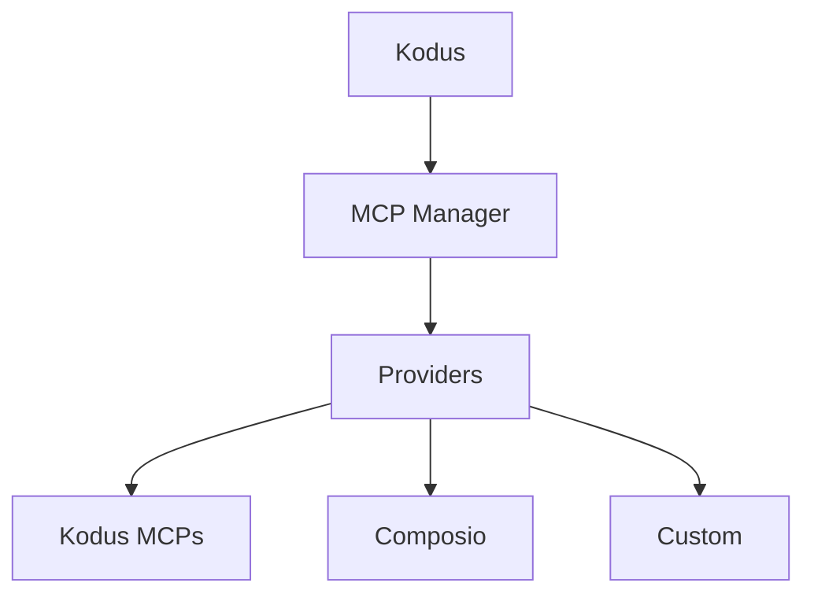

## ¿Qué son los MCPs?

Model Context Protocol (MCP) es un estándar abierto que permite a las aplicaciones de LLM conectarse a
herramientas externas y fuentes de datos a través de una interfaz de servidor consistente. Los servidores
MCP publican esquemas de herramientas y endpoints para que clientes como Kodus/Kody puedan obtener
contexto o ejecutar acciones durante un flujo de trabajo.

## Arquitectura de MCP Manager

MCP Manager es el servicio backend que gestiona esas conexiones MCP para
Kodus. Lleva un registro de los proveedores, integraciones y herramientas permitidas por
workspace, y luego expone ese catálogo a la API de Kodus.

- Registro central de proveedores MCP (Kodus, Composio y personalizados)
- Almacena metadatos de integración (estado de conexión, URL MCP, herramientas permitidas)
- Gestiona los flujos de autenticación específicos de cada proveedor y el descubrimiento de herramientas
- Expone APIs que Kodus usa para listar e invocar herramientas MCP

## Plugins en Kodus

Todo lo registrado en MCP Manager aparece en la pantalla de **Plugins** de Kodus,
para que tu equipo pueda instalar, gestionar y habilitar los MCPs disponibles para cada
workspace.

## Proveedores

### Proveedor Kodus

El proveedor Kodus agrupa los MCPs de primera parte gestionados por Kodus, incluyendo el
Kodus MCP, Context7 MCP y Kodus Docs MCP.

### Proveedor Composio

Composio es una plataforma de integración gestionada con un amplio catálogo de herramientas SaaS.
MCP Manager usa Composio para la autenticación y para aprovisionar endpoints MCP
que Kodus puede llamar. Consulta la documentación oficial para detalles de configuración:
[Documentación MCP de Composio](https://docs.composio.dev/docs/mcp-providers)

### Proveedores personalizados

Puedes agregar proveedores personalizados para integrar sistemas internos o plataformas de terceros.
En despliegues auto-hospedados, lista el proveedor en
`API_MCP_MANAGER_MCP_PROVIDERS` y luego implementa el proveedor en el código fuente de MCP Manager.
La implementación de referencia se encuentra aquí:
[repositorio kodus-mcp-manager](https://github.com/kodustech/kodus-mcp-manager#-adding-a-new-provider)

## Configurar Composio

1. Crea una cuenta en Composio y una integración para la herramienta que deseas
   exponer.
2. Habilita o crea un servidor MCP para esa integración (consulta la documentación de Composio).
3. Establece estas variables en tu `.env` de Kodus:
   - `API_MCP_MANAGER_COMPOSIO_API_KEY`
   - `API_MCP_MANAGER_COMPOSIO_BASE_URL` (por defecto:
     `https://backend.composio.dev/api/v3`)
4. Asegúrate de que `composio` esté listado en `API_MCP_MANAGER_MCP_PROVIDERS`.
