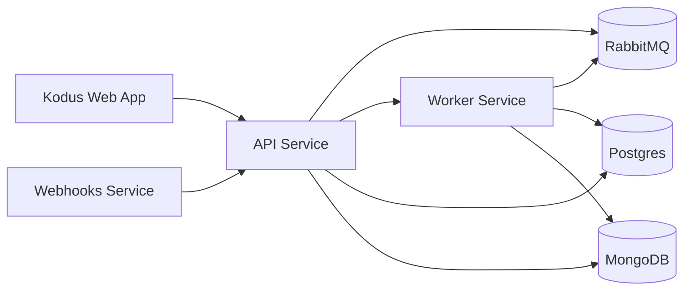

## Descripción general

Este documento describe la arquitectura que impulsa la infraestructura de Kodus. Nuestro sistema está construido sobre una arquitectura distribuida que aprovecha la containerización y la segmentación de red para garantizar la máxima escalabilidad, seguridad y mantenibilidad.

## Redes y componentes clave

La infraestructura está dividida en redes Docker que separan el acceso público
del tráfico interno entre servicios:

- shared-network: Servicios de cara al público y enrutamiento perimetral
- kodus-backend-services: Comunicación interna entre servicios
- monitoring-network: Tráfico de métricas y observabilidad (opcional)

## Componentes

### 1. Aplicación Web de Kodus

Nuestra plataforma frontend está construida con Next.js, brindando una experiencia de usuario fluida a través de la comunicación directa con nuestra capa de API.

### 2. Servicios de backend principales

El stack 2.0 divide las responsabilidades del backend en servicios dedicados:

- API: Capa de servicio central que gestiona la lógica de negocio y el procesamiento de solicitudes
- Worker: Procesamiento asíncrono para colas y tareas en segundo plano
- Webhooks: Servicio dedicado para los webhooks del proveedor de Git

### 3. MCP Manager

MCP Manager cataloga proveedores e integraciones, y los expone a Kodus para que
los equipos puedan instalar MCPs desde la pantalla de Plugins.

### 4. Almacenes de datos

Kodus utiliza dos bases de datos:

- Postgres: Datos relacionales y metadatos de embeddings
- MongoDB: Almacenamiento flexible de documentos

### 5. Mensajería y observabilidad

RabbitMQ es obligatorio en la versión 2.0, proporcionando comunicación asíncrona
confiable entre la API, el worker y los webhooks.

Prometheus y Grafana son opcionales y se utilizan para monitoreo y visualización.

### 6. Servicios auxiliares (Kodus Cloud)

Kodus Cloud incluye servicios auxiliares de código cerrado (facturación, analíticas e
integraciones de chat) que no son necesarios para los despliegues auto-hospedados.

## Próximos pasos
<CardGroup cols={2}>
  <Card title="Ejecutar Kodus localmente" icon="laptop" href="/how_to_deploy/es/local_quickstart/orchestrator">
    Ideal para el desarrollo local y para familiarizarse con el stack completo de Kodus.
  </Card>
  <Card title="Desplegar Kodus en producción" icon="rocket" href="/how_to_deploy/es/deploy_kodus/generic_vm">
    Perfecto para el despliegue en producción y para experimentar todas las capacidades de Kodus.
  </Card>
</CardGroup>
