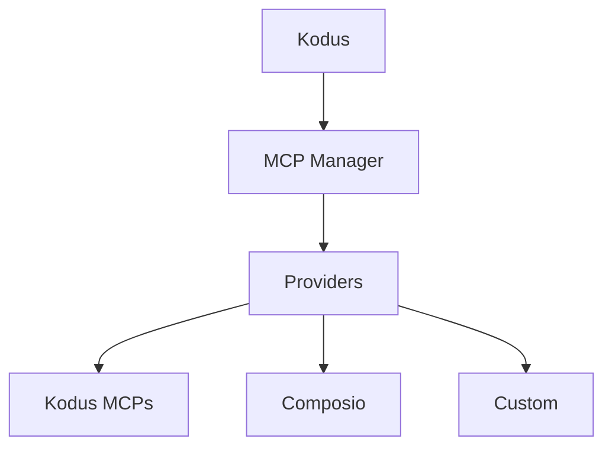

## MCPとは？

Model Context Protocol（MCP）は、LLMアプリが一貫したサーバーインターフェースを通じて外部ツールやデータソースに接続できるオープンスタンダードです。MCPサーバーはツールスキーマとエンドポイントを公開し、Kodus/Kodyのようなクライアントがワークフロー中にコンテキストを取得したりアクションを実行したりできるようにします。

## MCP Managerのアーキテクチャ

MCP ManagerはKodusのMCP接続を仲介するバックエンドサービスです。プロバイダー、インテグレーション、ワークスペースごとに許可されたツールを追跡し、そのカタログをKodus APIに公開します。

- MCPプロバイダー（Kodus、Composio、カスタム）の中央レジストリ
- インテグレーションのメタデータ（接続ステータス、MCP URL、許可されたツール）を保存
- プロバイダー固有の認証フローとツール検出を処理
- KodusがMCPツールをリスト・呼び出すために使用するAPIを公開

## KodusのPlugins

MCP Managerに登録されたすべてのものがKodusの**Plugins**スクリーンに表示されるため、チームは各ワークスペースで利用可能なMCPをインストール、管理、有効化できます。

## プロバイダー

### Kodusプロバイダー

KodusプロバイダーはKodusが管理するファーストパーティMCPをバンドルしており、Kodus MCP、Context7 MCP、Kodus Docs MCPが含まれます。

### Composioプロバイダー

ComposioはSaaSツールの大規模なカタログを持つマネージドインテグレーションプラットフォームです。MCP ManagerはComposioを認証と、KodusがコールできるMCPエンドポイントのプロビジョニングに使用します。セットアップの詳細については公式ドキュメントを参照してください：
[Composio MCPドキュメント](https://docs.composio.dev/docs/mcp-providers)

### カスタムプロバイダー

内部システムやサードパーティプラットフォームを統合するためにカスタムプロバイダーを追加できます。セルフホスト型デプロイメントでは、`API_MCP_MANAGER_MCP_PROVIDERS`にプロバイダーをリストし、MCP Managerのコードベースにプロバイダーを実装してください。リファレンス実装はこちらにあります：
[kodus-mcp-managerリポジトリ](https://github.com/kodustech/kodus-mcp-manager#-adding-a-new-provider)

## Composioの設定

1. Composioのアカウントを作成し、公開したいツールのインテグレーションを作成します。
2. そのインテグレーション用のMCPサーバーを有効化または作成します（Composioのドキュメントを参照）。
3. Kodusの`.env`に以下の変数を設定します：
   - `API_MCP_MANAGER_COMPOSIO_API_KEY`
   - `API_MCP_MANAGER_COMPOSIO_BASE_URL`（デフォルト：
     `https://backend.composio.dev/api/v3`）
4. `API_MCP_MANAGER_MCP_PROVIDERS`に`composio`がリストされていることを確認します。
