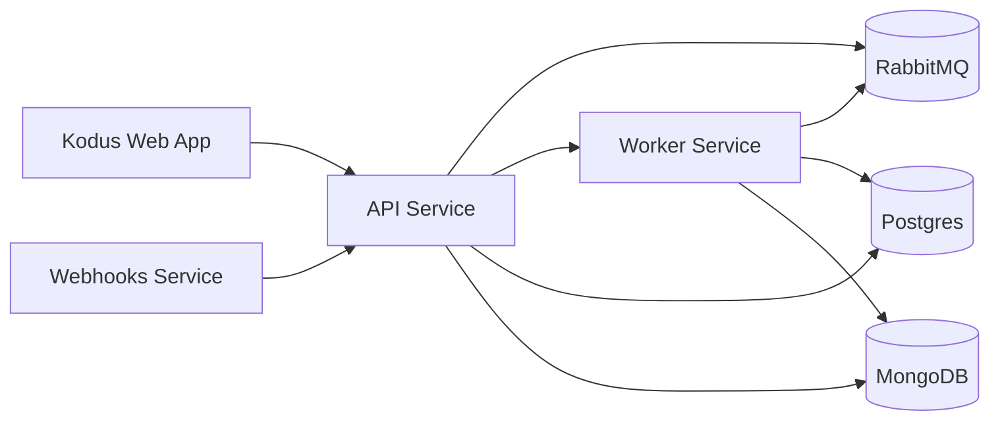

## 概要

このドキュメントでは、Kodusのインフラストラクチャを支えるアーキテクチャについて説明します。当システムはコンテナ化とネットワーク分割を活用した分散アーキテクチャで構築されており、最大限のスケーラビリティ、セキュリティ、保守性を確保しています。

## ネットワークと主要コンポーネント

インフラストラクチャは、パブリックアクセスと内部サービストラフィックを分離するDockerネットワークに分割されています：

- shared-network: 公開サービスとエッジルーティング
- kodus-backend-services: サービス間内部通信
- monitoring-network: メトリクスとオブザーバビリティトラフィック（オプション）

## コンポーネント

### 1. Kodus Webアプリケーション

フロントエンドプラットフォームはNext.jsで構築されており、APIレイヤーとの直接通信によってシームレスなユーザー体験を提供します。

### 2. コアバックエンドサービス

2.0スタックでは、バックエンドの責務を専用サービスに分割しています：

- API: ビジネスロジックとリクエスト処理を担う中央サービスレイヤー
- Worker: キューとバックグラウンドジョブの非同期処理
- Webhooks: GitプロバイダーWebhookの専用サービス

### 3. MCP Manager

MCP Managerはプロバイダーとインテグレーションをカタログ化し、Kodusに公開することで、チームがPlugins画面からMCPをインストールできるようにします。

### 4. データストア

Kodusは2つのデータベースを使用します：

- Postgres: リレーショナルデータと埋め込みメタデータ
- MongoDB: 柔軟なドキュメントストレージ

### 5. メッセージングとオブザーバビリティ

RabbitMQは2.0で必須であり、API、ワーカー、Webhooks間の信頼性の高い非同期通信を提供します。

PrometheusとGrafanaはオプションで、モニタリングと可視化に使用されます。

### 6. 補助サービス（Kodus Cloud）

Kodus Cloudには、セルフホスト型デプロイメントには不要なクローズドソースの補助サービス（課金、アナリティクス、チャットインテグレーション）が含まれています。

## 次のステップ
<CardGroup cols={2}>
  <Card title="Kodusをローカルで実行する" icon="laptop" href="/how_to_deploy/ja/local_quickstart/orchestrator">
    ローカル開発とKodusのフルスタックを理解するのに最適です。
  </Card>
  <Card title="Kodusを本番環境にデプロイする" icon="rocket" href="/how_to_deploy/ja/deploy_kodus/generic_vm">
    本番環境へのデプロイとKodusの全機能を体験するのに最適です。
  </Card>
</CardGroup>
