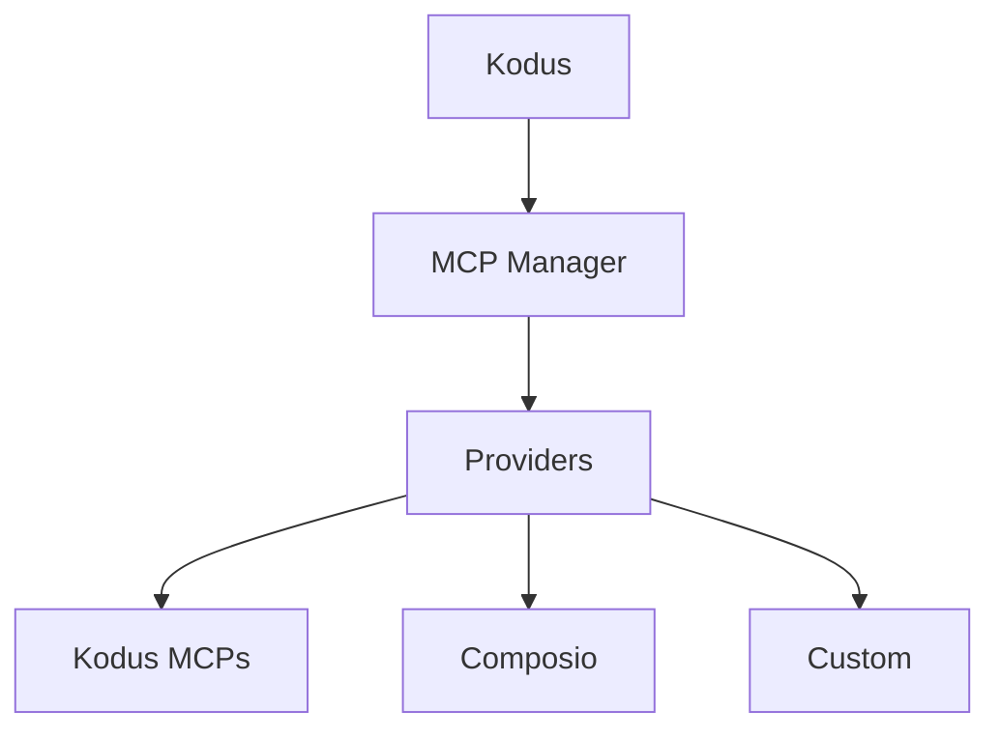

## O que são MCPs?

Model Context Protocol (MCP) é um padrão aberto que permite que aplicativos de LLM se conectem a
ferramentas externas e fontes de dados por meio de uma interface de servidor consistente. Os
servidores MCP publicam esquemas de ferramentas e endpoints para que clientes como o Kodus/Kody possam buscar
contexto ou executar ações durante um fluxo de trabalho.

## Arquitetura do MCP Manager

O MCP Manager é o serviço de backend que intermediia essas conexões MCP para
o Kodus. Ele rastreia provedores, integrações e ferramentas permitidas por
workspace, e então expõe esse catálogo para a API do Kodus.

- Registro central de provedores MCP (Kodus, Composio e custom)
- Armazena metadados de integração (status de conexão, URL MCP, ferramentas permitidas)
- Gerencia fluxos de autenticação específicos de cada provedor e descoberta de ferramentas
- Expõe APIs usadas pelo Kodus para listar e invocar ferramentas MCP

## Plugins no Kodus

Tudo que está registrado no MCP Manager aparece na tela de **Plugins** do Kodus,
para que sua equipe possa instalar, gerenciar e habilitar os MCPs disponíveis para cada
workspace.

## Provedores

### Provedor Kodus

O provedor Kodus agrupa MCPs próprios gerenciados pelo Kodus, incluindo o
Kodus MCP, Context7 MCP e Kodus Docs MCP.

### Provedor Composio

Composio é uma plataforma de integração gerenciada com um grande catálogo de ferramentas SaaS.
O MCP Manager usa o Composio para autenticação e para provisionar endpoints MCP
que o Kodus pode chamar. Consulte a documentação oficial para detalhes de configuração:
[Composio MCP docs](https://docs.composio.dev/docs/mcp-providers)

### Provedores Customizados

Você pode adicionar provedores customizados para integrar sistemas internos ou plataformas
de terceiros. Em implantações self-hosted, liste o provedor em
`API_MCP_MANAGER_MCP_PROVIDERS`, e então implemente o provedor na base de código do MCP Manager.
A implementação de referência está aqui:
[kodus-mcp-manager repo](https://github.com/kodustech/kodus-mcp-manager#-adding-a-new-provider)

## Configurando o Composio

1. Crie uma conta no Composio e uma integração para a ferramenta que deseja
   expor.
2. Habilite ou crie um servidor MCP para essa integração (consulte a documentação do Composio).
3. Defina estas variáveis no seu `.env` do Kodus:
   - `API_MCP_MANAGER_COMPOSIO_API_KEY`
   - `API_MCP_MANAGER_COMPOSIO_BASE_URL` (padrão:
     `https://backend.composio.dev/api/v3`)
4. Certifique-se de que `composio` está listado em `API_MCP_MANAGER_MCP_PROVIDERS`.
